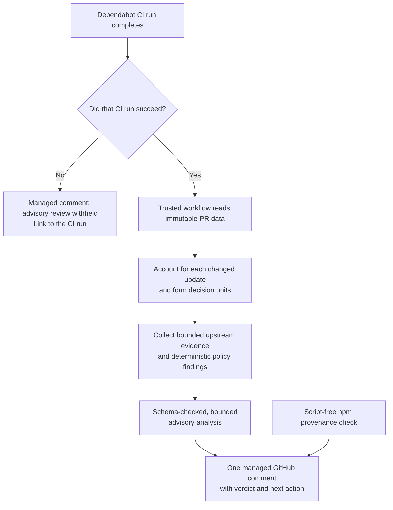

# Dependabot intelligent review guide — maintainers and reviewers — 2026-09-22

This guide explains how to use and operate the Dependabot intelligent-review
workflow. Its comment is decision support, not a merge control: it does not
replace GitHub CI, change branch protection, or approve a pull request for you.

## Start here: make the next action explicit

When a Dependabot pull request has an intelligent-review comment, read its
**Advisory verdict** and **Next action** before reading package detail.

- **merge** — Every decision unit has a validated assessment and the evidence
  supports an advisory merge recommendation. Complete the repository's normal
  pull-request review; this is not an automatic approval.
- **merge with followups** — Every decision unit is complete. Record the
  explicitly listed _non-blocking_ follow-ups, then make the normal human merge
  decision.
- **do not merge** — Resolve and validate the documented blockers before
  merging.
- **decision incomplete** — There is no merge recommendation. Complete every
  item in the **Decision queue** first. The queue names the affected decision
  unit, the evidence gap, and the next action.
- **analysis unavailable** — The bounded advisory analysis could not finish.
  Correct the stated failure and rerun the review; do not treat the absence of
  advice as approval.

The comment is deliberately concise. Its purpose is to answer “what should I
do now?” rather than repeat CI output or summarize every release note.

## How a review becomes a comment



The workflow runs only after a completed CI run for a Dependabot pull request.
If that CI run did not conclude successfully, it publishes a short
`decision incomplete` comment that points to the triggering run and skips
evidence collection and model analysis. This prevents an advisory “merge” from
appearing next to a red CI result without turning the comment into a CI summary.

## Read the supporting sections in the right order

After the verdict and next action, use only the sections that change your
decision.

### Decision queue

This section appears when the verdict is `decision incomplete`. Treat it as a
stop sign, not a list of optional chores. Each entry tells you whether the
unresolved unit is a direct dependency update or a standalone update, how many
changed packages it represents, the missing fact, and the action needed to
resolve it.

If a queue is too large for a GitHub comment, the comment says exactly how many
decision units are not shown. It still withholds a merge recommendation until
every unit is resolved.

### Decision coverage

Coverage answers whether every changed update has been accounted for in the
right decision unit. It does **not** mean every transitive package was
individually researched.

For npm updates, the workflow uses the immutable `package-lock.json` graph to
group a changed direct dependency with its unambiguous changed transitive
members. The direct dependency is the evidence anchor. Any ambiguous, orphaned,
or otherwise unprovable relationship stays a standalone decision unit instead
of being silently treated as safe.

Lifecycle-script changes are decision-relevant. The workflow compares the
immutable base and pull-request lockfiles and, when needed, checks exact public
npm metadata for `preinstall`, `install`, and `postinstall` changes.

### Advisory provenance

Provenance is an integrity signal for the proposed public npm dependency tree.
It reports one of:

- **verified** — npm reported no missing or invalid signatures or provenance
  attestations;
- **attention required** — npm identified missing or invalid entries; or
- **unavailable** — the check could not safely run.

Use this signal as additional review context. It does not prove runtime
behavior, change the policy result, or alter the advisory verdict by itself.

### Reasons not to merge and non-blocking follow-ups

**Reasons not to merge** contain deterministic, source-backed blockers and
their validation steps. They are the material to resolve before merging.

**Non-blocking follow-ups** appear only with `merge with followups`. They refer
to a currently visible repository surface and are explicitly marked
non-blocking. Optional adoption ideas, generic release-note checks, and
hypothetical future configuration do not justify this verdict.

### Research prompts and new capabilities

When a decision unit needs human investigation, the comment can include a
collapsed, copyable research prompt. It is pinned to the pull request's immutable head
and review digest, asks for read-only investigation using cited official or
package sources, and asks the researcher to conclude `merge` or `hold for
review` with remaining uncertainty.

External research is for the human reviewer. The workflow never reads a
ChatGPT, Claude, or other research response back into its evidence, policy, or
verdict. Record any decision in the normal GitHub review process.

New-capability items are separate from risk assessment. They identify opt-in
functionality that may help a use case already visible in this repository; they
do not create a merge blocker or a follow-up by themselves.

## Why the review is safe to run after CI

The review job has a privileged ability to update its one managed comment, so
it keeps a strict trust boundary:

- It checks out trusted default-branch workflow code, never pull-request code.
- It reads pull-request manifests and lockfiles by immutable GitHub SHA and
  treats all fetched content as untrusted data.
- It validates evidence URLs, bounds excerpts and requests, and gives the model
  only a bounded, vetted packet.
- It validates the model's structured response against the decision units,
  evidence, and policy. The model cannot add a source, invent a blocker, or
  relax a deterministic policy ceiling.
- The provenance exception installs only a generated, public-registry package
  tree in an action-owned temporary directory with lifecycle scripts disabled.
  It reads only validated dependency maps and overrides; it never executes the
  pull request.

These controls explain an important distinction: a grouped dependency update
can be _covered_ by a direct update's lockfile relationship without being
claimed as independently researched or automatically safe.

## Operate and replay the workflow

The normal path is automatic. A completed CI run on a Dependabot pull request
starts the reviewer, and the reviewer keeps one managed comment up to date for
that pull request and immutable head.

For a local, no-write inspection of the review input, run:

```sh
npm run dependabot:review:dry-run -- <pull-request-number> --preflight
```

This requires authenticated GitHub CLI access, prints only the number and type
of reviewable updates, and does not retrieve the Mistral credential or write a
GitHub comment.

For a full local rendering of the advisory comment, run:

```sh
npm run dependabot:review:dry-run -- <pull-request-number>
```

The full rendering also needs the local Mistral credential through 1Password.
It prints Markdown to standard output and remains a no-write regression check.
Use it to inspect wording or reproduce a reviewer-facing result; do not use it
as a substitute for GitHub's immutable CI-triggered workflow.

### Expected no-op and recovery behavior

- A repeat event for an already reviewed immutable head skips expensive
  collection and analysis. A new head always receives a fresh digest and
  review.
- The GitHub evidence client permits at most two concurrent GitHub requests and
  160 requests in one review run. On a 403, 429, or local budget exhaustion, it
  stops rather than retrying and preserves unaffected decision units.
- A malformed or schema-invalid model response gets one bounded retry. A
  repeated failure becomes an explicit decision-queue item instead of erasing
  successful assessments from other units.
- If an upstream publisher provides no public upgrade evidence, that absence is
  reported honestly but is not automatically a human research task. A failed
  evidence collection, by contrast, becomes a concrete incomplete decision.
- If rate limiting occurs before a review packet can be built, the workflow
  leaves the previous managed comment unchanged and records a bounded
  diagnostic. Rerun after the transient condition has cleared.

## Maintain the contract deliberately

Treat these as design changes, not routine tuning: workflow permissions or
triggers, timeout and request budgets, model/provider behavior, evidence
providers, secrets, comment ownership, and any rule that turns advisory output
into a merge requirement. Review their security and decision-quality impact
before changing them.

The implementation is tested with mocked network/model boundaries, focused
subprocess tests for provenance, and a captured PR #271 input/render fixture.
The fixture keeps the maintainer-facing output testable without a live model key
or a write to GitHub.

## Related decision records

For the detailed contracts and rationale, see:

- [Decision coverage specification](../SPEC-dependabot-decision-coverage.md)
- [Analysis contract](../SPEC-analysis-contract.md)
- [Evidence collection specification](../SPEC-evidence-collection.md)
- [Provenance evidence specification](../SPEC-provenance-evidence.md)
- [GitHub request guardrails](../SPEC-dependabot-github-request-guardrails.md)
- [Comment experience specification](../SPEC-comment-experience.md)
